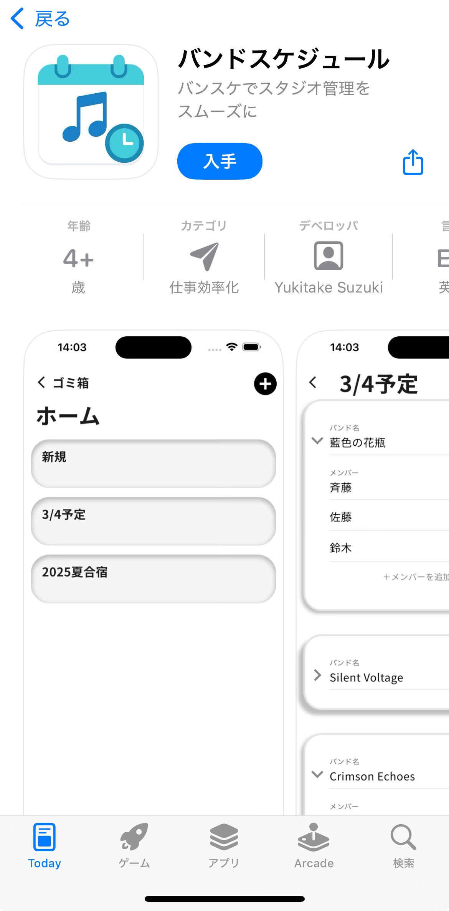

# バンドスケジュール
App Store URL : https://apps.apple.com/jp/app/%E3%83%90%E3%83%B3%E3%83%89%E3%82%B9%E3%82%B1%E3%82%B8%E3%83%A5%E3%83%BC%E3%83%AB/id6751800211

### バンドのスケジュールを管理できるアプリ

このアプリは複数のバンド名とバンドメンバーを保存し、スケジュールを立てることができます。  
特に複数のスタジオ（練習部屋）を時間ごとに使い分ける場面で役立ちます。
たとえば、1時間目はAバンド、2時間目はBバンド…と、時間帯ごとに使用するバンドが変わる場合に、どのバンドがどのスタジオを利用するかを自動的に割り当てます。  
さらに、メンバーが複数のバンドを掛け持ちしている場合も考慮し、同じ時間帯に同じ人が別のバンドで練習が重ならないように調整します。
## 開発背景
私は大学で軽音楽サークルに所属し、毎年2回の合宿を行っていました。合宿所には8部屋ほどのスタジオがあり、24時間自由に利用できるため、サークル内で「合宿係」がスタジオの時間割を作成していました。  
私の代が上級生となった際、時間割作成の役割を担うことになり、先輩に方法を尋ねたところ、プログラミングができる先輩が独自に作った Python のソースコードを受け取りました。しかし、そのコードは可読性が低く、プログラミングを理解している人しか扱えなかったため、時間割作成に大変苦労しました。  
この経験から、
**「プログラミングができない人でも簡単に時間割を作れる仕組みが必要だ」**
と強く感じました。そこで、後輩たちが誰でも使えるようにと、状況に適したアプリを自ら開発することを決意しました。