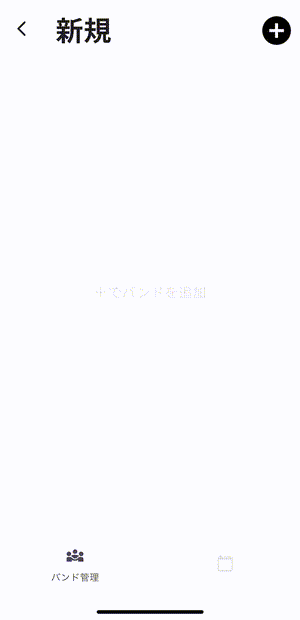
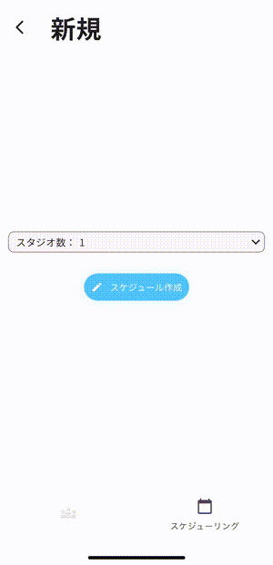
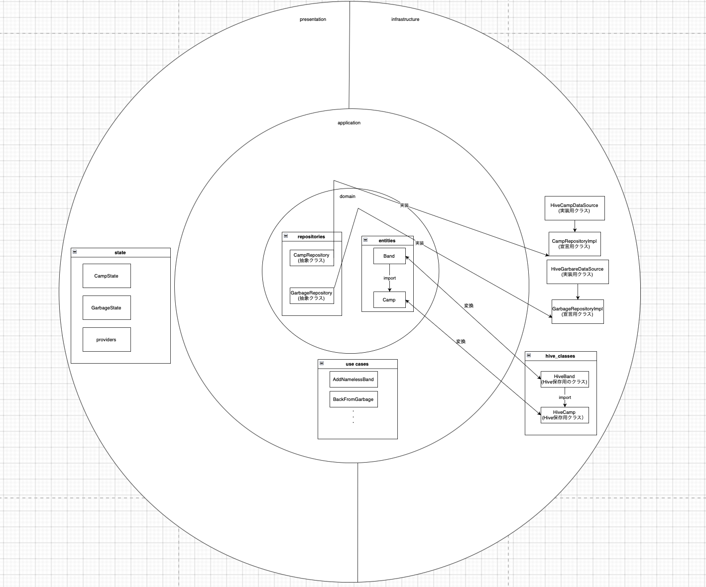
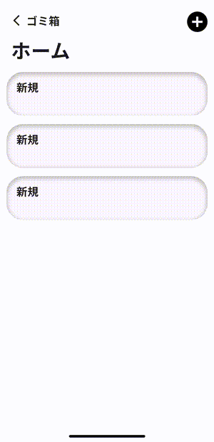
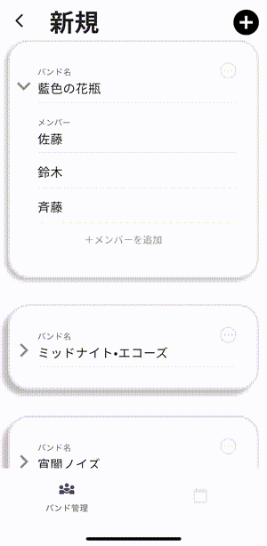
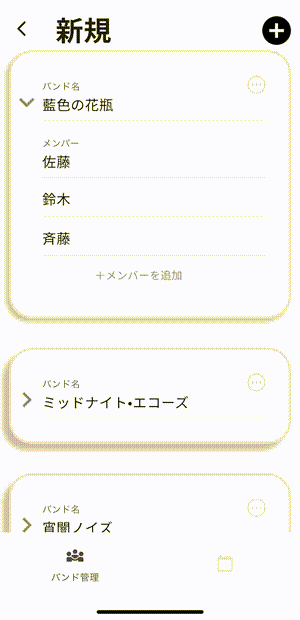
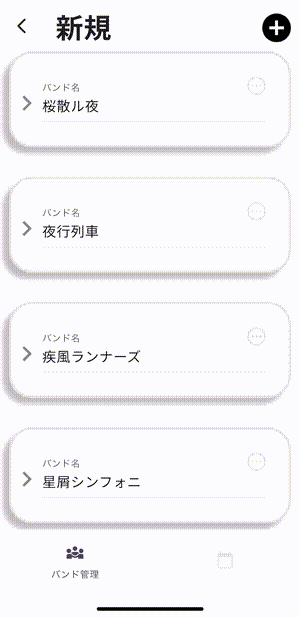

# バンドスケジュール
App Store URL : https://apps.apple.com/jp/app/%E3%83%90%E3%83%B3%E3%83%89%E3%82%B9%E3%82%B1%E3%82%B8%E3%83%A5%E3%83%BC%E3%83%AB/id6751800211

### バンドのスケジュールを管理できるアプリ

このアプリは複数のバンド名とバンドメンバーを保存し、スケジュールを立てることができます。  
特に複数のスタジオ（練習部屋）を時間ごとに使い分ける場面で役立ちます。
たとえば、1時間目はAバンド、2時間目はBバンド…と、時間帯ごとに使用するバンドが変わる場合に、どのバンドがどのスタジオを利用するかを自動的に割り当てます。  
さらに、メンバーが複数のバンドを掛け持ちしている場合も考慮し、同じ時間帯に同じ人が別のバンドで練習が重ならないように調整します。
## 開発背景
私は大学で軽音楽サークルに所属し、毎年2回の合宿を行っていました。合宿所には8部屋ほどのスタジオがあり、24時間自由に利用できるため、サークル内で「合宿係」がスタジオの時間割を作成していました。  
私の代が上級生となった際、時間割作成の役割を担うことになり、先輩に方法を尋ねたところ、プログラミングができる先輩が独自に作った Python のソースコードを受け取りました。しかし、そのコードは可読性が低く、プログラミングを理解している人しか扱えなかったため、時間割作成に大変苦労しました。  
この経験から、
**「プログラミングができない人でも簡単に時間割を作れる仕組みが必要だ」**
と強く感じました。そこで、後輩たちが誰でも使えるようにと、状況に適したアプリを自ら開発することを決意しました。
## 主要な機能

<table style="width: 100%; table-layout: fixed; border: 1px solid black;">
  <tr>
    <th style="width: 50%; border: 1px solid black;text-align: center">バンドを登録</th>
    <th style="width: 50%; border: 1px solid black;text-align: center">スケジュールを作成</th>
  </tr>
  <tr>
    <td style="width: 50%; border: 1px solid black;text-align: center">
        
    </td>
    <td style="width: 50%; border: 1px solid black;text-align: center">
        
    </td>
  </tr>
  <tr>
    <td style="width: 50%; border: 1px solid black;text-align: center">右上のプラスボタンからバンドを追加し、バンド名、バンドメンバーを入力します。</td>
    <td style="width: 50%; border: 1px solid black;text-align: center">バンドを全て登録した後、スタジオ数を選択しスケジュールを作成を押すと予めプログラムされた貪欲法が実行されスケジュールが作成されます。</td>
  </tr>
</table>
(拡張子変換の際に本来薄い灰色で描画されているものが掲載したGIFでは赤い網目になってしまっています)

## 使用技術
|カテゴリ|技術|
|:---|:---|
|フロントエンド|Flutter 3.32.5 (Dart 3.8.1)|
|データ管理|Hive 2.2.3 (dart/flutter package)|
|状態管理|Riverpod 2.4.0 (dart/flutter package)|
### 技術選定理由
開発背景にもあるようにサークルの人が誰でもこのアプリを使って時間割を簡単に作れるようになって欲しかったために、クロスプラットフォームのアプリ開発フレームワークを選択しました。中でも現在注目度が上がりつつ、UIの一貫性、高速でなめらかな描画などパフォーマンスが比較的高いFlutterを選択しました。またすでに学んだことのあるJavaに近いオブジェクト指向言語であること、ホットリロードによるスムーズな開発ができることも選定の理由になります。

## 画面遷移図

UIのデザインなどはFigmaを用いて作成しました。Figmaの使用や、UIのデザインは初めてであったため、既存のメモアプリやFigma内の他の人の投稿を参考に、デザインが良いものや使いやすそうなものを積極的に取り入れました。普段無意識で見ていて気がつかなかったデザインにおける影の重要性や色の統一感の重要性に気づくことができました。

## クラス設計

全てではないですがこちらが主要なクラスになります。円の中の文字、四角で区切られた題名がフォルダー名、四角の中がクラス名を表しています。  
完全独学のためこれが正しい構造をしているかは少し自信がないですが、オニオンアーキテクチャを参考に保守性の高い設計を心がけました。全てのクラスが自分より外側のクラスを参照(import)することがないようになっており、基盤となるdomain層を崩さずにサービスの追加ができるようになっています。特にdomain層のrepositoriesはDartのオブジェクト指向を生かし、domain層の中では抽象クラスにとどめ、それをapplication層のusecasesで利用、infrastructure層で初めて実装を行ない、providersで状態を管理しています。これによりHive以外でデータを保存したい場合もdomain層の中は触れずに後付けで実装できるようになっています。

## 些細なこだわり,UX向上
削除の際は左側にスライドすれば良いのではないかといったように説明がなくても今までの経験によって予想のつく直感的な操作の実装を(当たり前かもしれませんが)意識的に心がけました。

<table style="width: 100%; table-layout: fixed; border: 1px solid black;">
  <tr>
    <th style="width: 50%; border: 1px solid black;text-align: center">スライド削除</th>
    <th style="width: 50%; border: 1px solid black;text-align: center">タイトル変更</th>
  </tr>
  <tr>
    <td style="width: 50%; border: 1px solid black;text-align: center">
        
    </td>
    <td style="width: 50%; border: 1px solid black;text-align: center">
        
    </td>
  </tr>
  <tr>
    <td style="width: 50%; border: 1px solid black;text-align: center">スライドによる直感的な削除</td>
    <td style="width: 50%; border: 1px solid black;text-align: center">これは少し分かりづらいですがタイトルを変更したくなったユーザーは、まずタップしてみるだろうと思いタップでタイトルを変更できるようにしています。</td>
  </tr>
</table>

また、ストレスなく操作してもらえるように以下も実装しました。

<table style="width: 100%; table-layout: fixed; border: 1px solid black;">
  <tr>
    <th style="width: 50%; border: 1px solid black;text-align: center">ウィジェットの折りたたみ</th>
    <th style="width: 50%; border: 1px solid black;text-align: center">自動スライド、自動標準、画面タップによる解除</th>
  </tr>
  <tr>
    <td style="width: 50%; border: 1px solid black;text-align: center">
        
    </td>
    <td style="width: 50%; border: 1px solid black;text-align: center">
        
    </td>
  </tr>
  <tr>
    <td style="width: 50%; border: 1px solid black;text-align: center">入力していくうちに下にスライドするのがかなり面倒になると感じ、バンドメンバーを折りたたみできるように設計しました。</td>
    <td style="width: 50%; border: 1px solid black;text-align: center">
    <ul>
        <li>バンド追加：プラスボタンを押すと画面が自動的にスクロールし、追加されたバンドをすぐに確認できるようにしました。これにより、ユーザーが「本当に追加されたのか」を探す手間をなくしました。</li>
        <li>メンバー追加：追加ボタンがキーボードに隠れてしまう問題を解消するため、押した際に自動でスクロールし、ストレスなく操作できるようにしました。</li>
        <li>入力終了：キーボード以外をタップすることで入力を閉じられるように設計し、直感的で快適な操作感を実現しました。</li>
    </ul>
    </td>
  </tr>
</table>